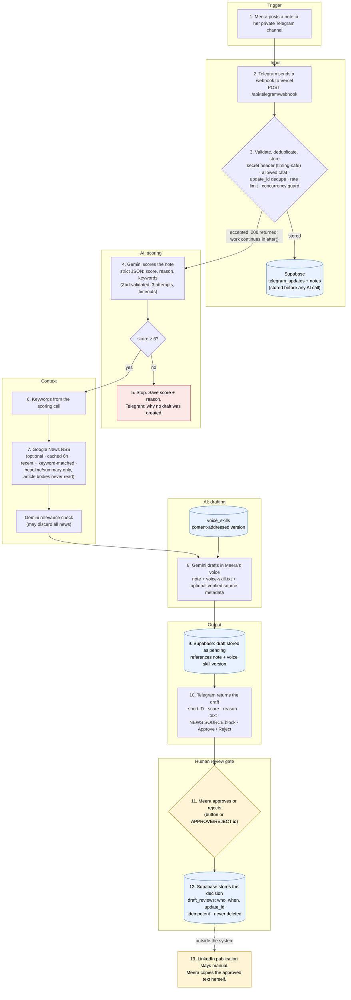

# Component map

How a note becomes a reviewed LinkedIn draft. LinkedIn publication is deliberately outside the automation.

## Components

| Stage      | Code                                                           | Notes                                                                                                                    |
| ---------- | -------------------------------------------------------------- | ------------------------------------------------------------------------------------------------------------------------ |
| Trigger    | Telegram channel                                               | The bot is an admin of Meera's private channel. Direct messages to the bot also work if that chat ID is the allowed one. |
| Input      | `app/api/telegram/webhook/route.ts`, `src/pipeline/webhook.ts` | Auth, allowed-chat check, dedupe, and note storage happen before the 200 response. AI work runs in Next's `after()`.     |
| Parsing    | `src/telegram/updates.ts`                                      | Zod-validated update parsing. Bot messages are ignored to prevent loops.                                                 |
| Storage    | `src/db/supabase.ts`, `supabase/migrations/*.sql`              | Multi-row writes are SQL functions, so each is one transaction.                                                          |
| Scoring    | `src/ai/prompts.ts`, `src/ai/schemas.ts`, `src/ai/gemini.ts`   | `@google/genai` with `responseJsonSchema`, Zod validation, bounded retries.                                              |
| Context    | `src/news/rss.ts`                                              | Google News RSS search only. Failures degrade to "no news".                                                              |
| Drafting   | `src/pipeline/processNote.ts`, `voice-skill.txt`               | The voice skill is sent on every drafting call. The model may only cite the exact news item it was given.                |
| Output     | `src/telegram/format.ts`, `src/telegram/client.ts`             | HTML-escaped, split under Telegram's 4096-character limit, buttons on the last message.                                  |
| Review     | `review_draft()` SQL function                                  | Row lock plus status check makes repeated clicks idempotent. Decisions are final.                                        |
| Operations | `app/api/health/route.ts`, `src/lib/logger.ts`                 | JSON logs with request and update IDs; secrets redacted. Failed updates are marked `dead_letter`.                        |
